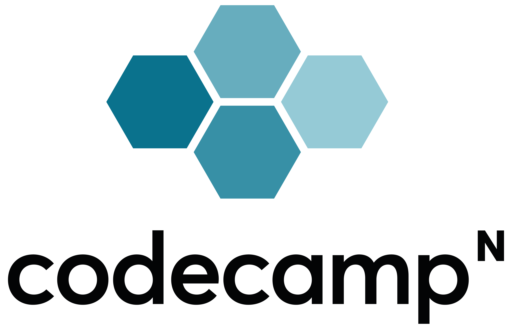
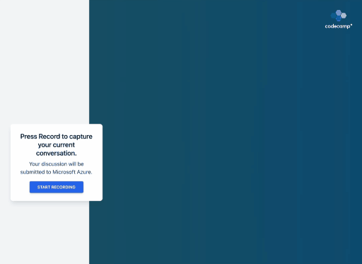

<a name="readme-top"></a>
<br />

<div align="center" >
  <a href="https://codecamp-n.com">
    
  </a>

  <h3 align="center">Scrum Story generator using OpenAI and Azure SpeechSDK</h3>

  <p align="center">
    A little showcase how to combine different SDKs to build AI driven MVPs.
  </p>

  
</div>
<br/>

# About

This repository contains a simple [Next.js](https://nextjs.org) app that forwards your microphone input to the Microsoft Speech-to-Text SDK. On pressing 'Generate Story' the text will be passed to OpenAIs davinci-03 model with an instruction to create a scrum user story.

> It is _not_ intended as a production ready application and there's a lot of room for improvement in the code base. But maybe it helps you kickstart your ideas!

# Local setup

## Prerequisites

- An Azure Speect-to-Text SDK key
- An OpenAI SDK Key
- NodeJS >= 19

## 1. Get an Azure speech SDK

You can use the Speech-to-Text SDK from azure **for free** with limitations. You can basically follow the prerequisites from this tutorial:

https://learn.microsoft.com/en-us/azure/cognitive-services/speech-service/get-started-speech-to-text

## 2. Get an OpenAI SDK Key

OpenAI allows you to spend 18$ in the first free months without providing a payment provider.

Create an account here: https://openai.com/ and create an API key here: https://platform.openai.com/account/api-keys

## 3. Install dependencies

You can use yarn or npm

```bash
yarn

#-- or --

npm install
```

## 4. Create an env file containing your keys

Copy the env file template to .env

```bash
cp ./.env.dist .env
```

Open .env in your editor and set `AZURE_SPEECH_SDK_KEY` and `OPENAI_KEY` with the keys from step 1 and 2.

## 5. Build and run

> You can also use yarn dev, but keep in mind that calling some endpoints the first time can trigger a rebuild and clear your azure sessions.

`yarn build && yarn start`

## 6. Open in your Browser

The default port is 8080, so you can simply open localhost:8080.
